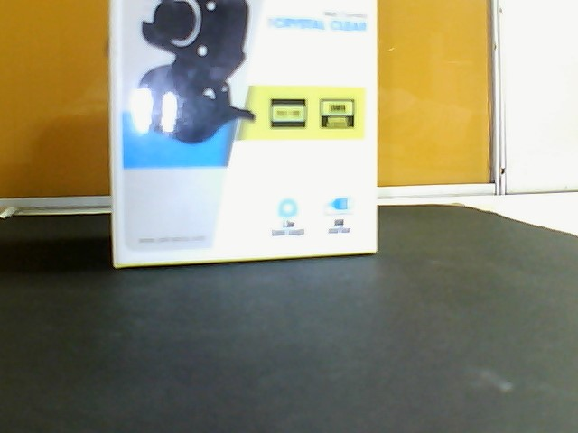
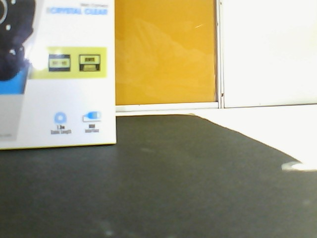
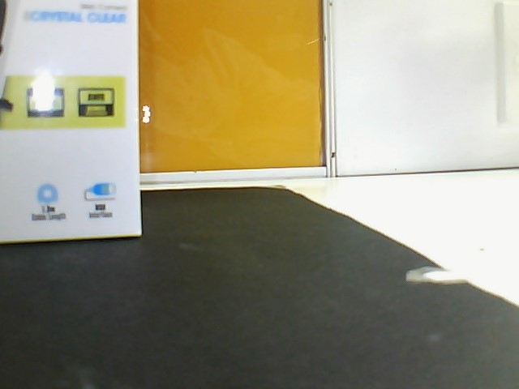
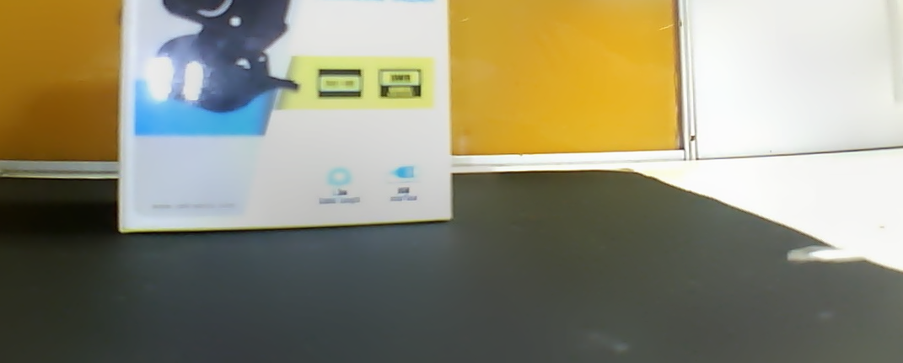

Image Stitching 
======

This script is designed to stitch together a series of images into a single panoramic image.

**Input Image**

**Output Image**

Usage
-----

1. Place the images to be stitched in a directory named "images" in the same directory as this script.
2. Run the script using Python (e.g. `python script.py`).
3. The script will stitch the images together and save the result as "stitchedOutput.png".
4. The script will then apply a series of image processing steps to the stitched image, including:
   - Adding a 10-pixel border to the image.
   - Converting the image to grayscale.
   - Applying binary thresholding to the grayscale image.
   - Finding the contour with the maximum area in the thresholded image.
   - Creating a mask from the contour and eroding it until it disappears.
   - Finding the minimum rectangle that contains the contour.
   - Cropping the stitched image to the minimum rectangle.
5. The final processed image will be saved as "stitchedOutputProcessed.png".

Requirements
------------

* Python 3.x
* OpenCV library (cv2)
* NumPy library (np)
* imutils library

Notes
-----

* This script assumes that the images to be stitched are in JPEG format and are located in a directory named "images".
* The script uses the OpenCV library to perform the image stitching and processing steps.
* The script uses the imutils library to simplify some of the image processing steps.
* The script is designed to be run from the command line.
